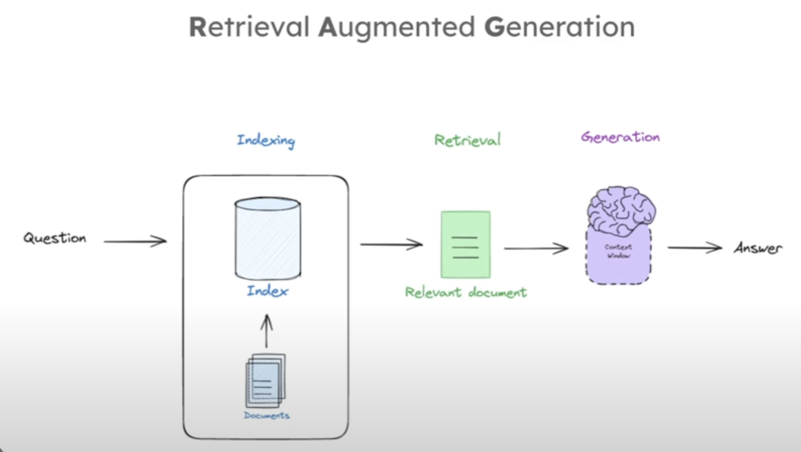
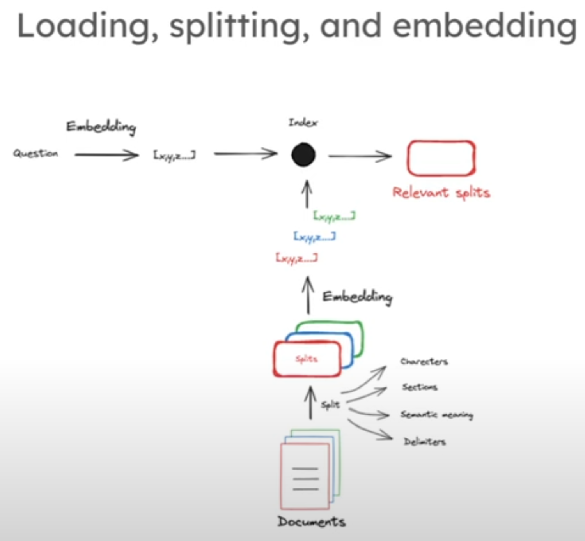

# My notes on Retrieval Augmented Generation (RAG)

RAG is a process, by which LLMs can access external data, to give the user a more context-appropriate and fact-based response.

## Motivation

LLMs don't have access to external data. This could be recent data or publicly unavailable information. This is also one of the reasons LLMs hallucinate. So we have to give it access to extrenal data in order to get more context appropriate and fact-based responses.

## RAG Pipeline

## Embeddings

Embeddings are numerical representations of text. There are different methods for embeddings, which can be split up into statistical (e.g. Bag of Words) and ML-based (embedding models) methods. Here is a [video](https://youtu.be/5MaWmXwxFNQ?si=3379aDAhLaQRFaVB) giving a broader overview of embedding methods.

In ML-based methods, a sequence of tokens is converted to a vector in a multidimensional space, where tokens of similar meaning are closer to each other. Using mathematical methods (e.g. cosine similarity) we can calculate the distance between these vectors.

### Indexing

Indexing in RAG pipelines involves loading external documents into a retriever for retrieving relevant information based on input questions.

1. Create embedding for the question/prompt
2. Split text into chunks
   - this is important bc embedding models have limited context lengths
3. Embed the chunks
4. Compare question embedding to chunk embeddings to determine relevant splits/chunks

## Sources

- [RAG from scratch playlist by LangChain](https://youtube.com/playlist?list=PLfaIDFEXuae2LXbO1_PKyVJiQ23ZztA0x&si=Ex_CXfIVbTEtI_UW)
- [Video by AssemblyAI: a comprehensive overview of word embeddings](https://youtu.be/5MaWmXwxFNQ?si=3379aDAhLaQRFaVB)
