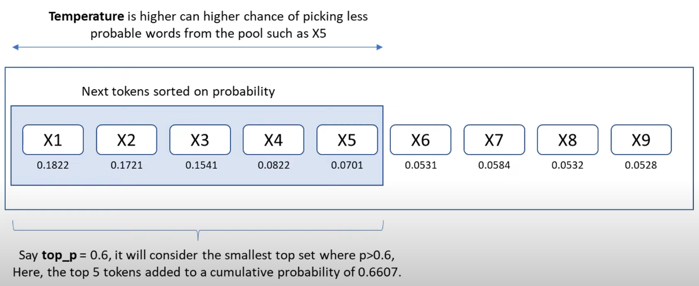

# Important terms to know

## tokens

Large language models (sometimes referred to as GPT's) process text using tokens, which are common sequences of characters found in a set of text. The models learn to understand the statistical relationships between these tokens, and excel at producing the next token in a sequence of tokens.

- [OpenAI Tokenizer](https://platform.openai.com/tokenizer)

## parameters

There are different parameters which can be used to control the output produced by a model.

### top-p

- determines the size of the (token) pool from which the next token will be selected
- higher top-p => larger token pool

### temperature

- determines the chance of picking the less probable next tokens
- higher temp => higher chance of picking less probable tokens

### controlling determinism

- both top-p and temperatur are used to control the determinism of a model

