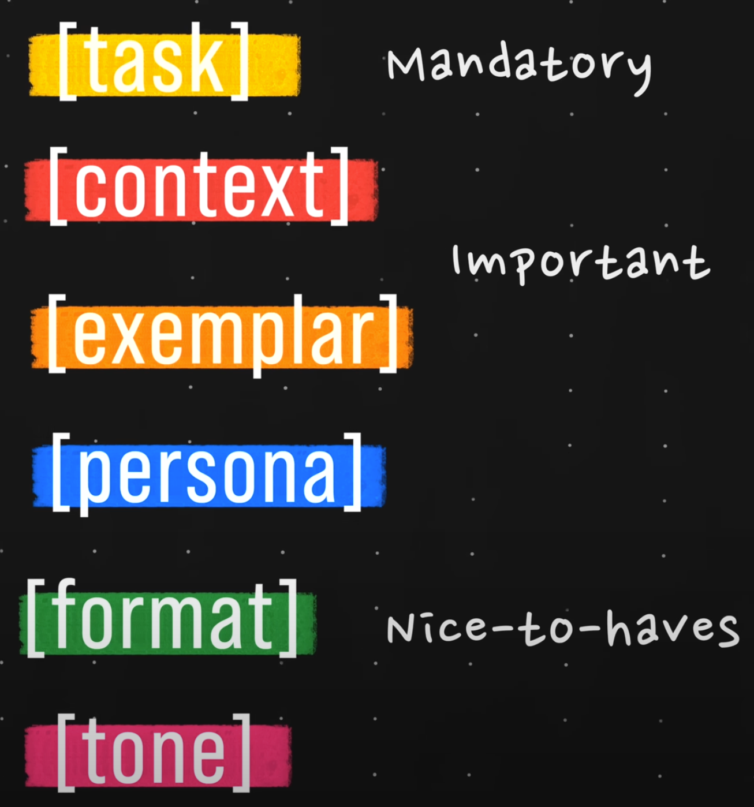

# Prompt Engineering for ChatGPT Cheat Sheet

This is my cheat sheet for writing effective prompts for ChatGPT. Creating effective prompts for ChatGPT can significantly improve the quality of the responses you receive.

## The components of a good prompt

### Task

**Give the model a specic task using a verb or ask an open ended question.**

- divide complex tasks into smaller, step-by-step instructions
- tell the AI how to solve your problem step-by-step

### Context

**Give background information to help ChatGPT understand your requirements.**

- answer the "W-questions"
- describe the situation

### Examplars

**Exemplars can drastically improve the quality of the output by giving specific examples for the AI to reference.**

- give examples of a good answer

### Persona

**Tell the AI who you would ideally want it to be in the given task situation.**

- persona can be a specific person (Steve Jobs, David Goggins, Batman etc.)
- or a description (a competent and polite customer support worker)

### Format

**Visualizing your desired end result will let you know what format to use in your prompt.**

- how should your desired result/answer look like?
- do you want the AI to use a specific framework for generating the answer?
  - e.g. SMART for setting goals or SWOT for project planning

### Tone

**And you can actually use ChatGPT to generate a list of Tone keywords for you to use!**

- how should the tone of the answer be?
- how should the answer sound?
- polite, considering, angry etc.
- pro tip: ask the AI for adjectives

## Sources

- [Promt Engineering 101 by Assembly AI](https://colab.research.google.com/drive/1lHd9b8C4ccAGpkK06dzcFB0asjXWGZi0?usp=sharing)
- [YouTube: Prompt Engineering 101 - Crash Course & Tips](https://youtu.be/aOm75o2Z5-o?si=8vaL1d7GU8ob7N7w)
- [YouTube: Master the Perfect ChatGPT Prompt Formula (in just 8 minutes)!](https://youtu.be/jC4v5AS4RIM?si=9cfv-0dVb9fbUfQ6)
